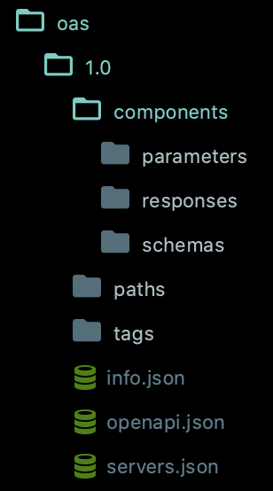

[](https://travis-ci.org/nasrulhazim/oas)

OAS is OpenAPI Specification generator. It will help to simplify generate your OAS from given database.

## Usage

**Create a new OAS**

```
$ php oas make:oas 1.0 
```

This will create a new OAS under `storage/oas/1.0`. You should have the following directory structure:

<center>
	
</center>

**Create a new OAS Schema**

```
$ php oas make:schema 1.0 table_name --connection=database_connection_name
```

> You need to specifiy `--connection` option if you planning on using other than default connection - `sqlite`

This will generate a new tag under `storage/oas/1.0/components/schemas` directory.

**Create a new OAS Tag**

```
$ php oas make:tag 1.0 "Name of the tag" "Description of the tag"
```

This will generate a new tag under `storage/oas/1.0/tags` directory.

**Create a new Path**

```
$ php oas make:path 1.0 get "Name of the tag" table_name operation_id --summary="Summary is optional, but best to have it together."
```

This will generate a new tag under `storage/oas/1.0/paths` directory.

## License

OAS is an open-source software licensed under the [MIT license](https://github.com/laravel-zero/laravel-zero/blob/stable/LICENSE.md).
